## Motivation
The substitution model breaks down when we introduce assignment. Since variables can now be updated with new values, we have to find a way to keep track of all the variables and their current values. We cannot simply substitute values as we will have no way of updating them afterwards.

## Frames
A frame is a table of bindings which associate variable names with their corresponding values. For constants, we use the symbol `:=` instead of `:`. 
```
{
    const w = 1;
    let x = true;
    let y = "null";
    let z = "This is a string";
}
```

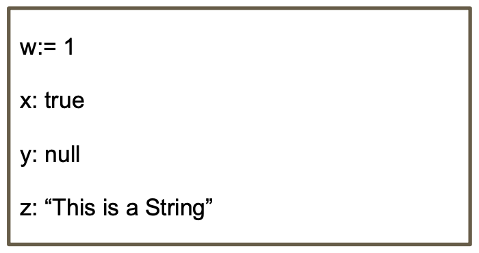

Primitive values can be written directly inside the frame. However, Compound structures should be drawn outside the frame with an arrow pointing to the compound structure.

```
{
    let x = pair(1, 2);
    let y = [];
    let z = [1, 2, 3];
}
```

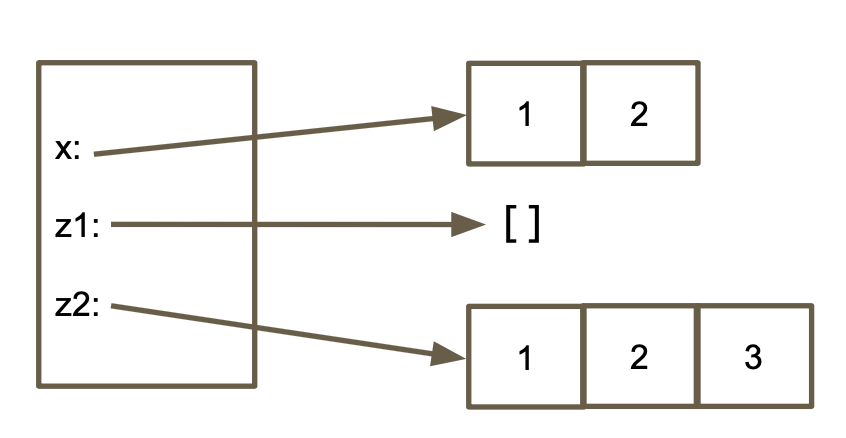

There are two special frames in the environment model
1. Global frame, the frame containing all pre-declared names.
2. Program frame, for declarations at the top level of your program. 

A frame is created whenever there is a pair of curly braces `{ }`.

:::note
There are no such thing as empty frames! (as of 20/21 sem 1)
:::

## Environment
An environment is a sequence of frames. Each frame has a "pointer" to it's enclosing environment, except the global frame. 

```
let x = 1;
{
    let y = 1;
    {
        let z = 1;
    }
}
```

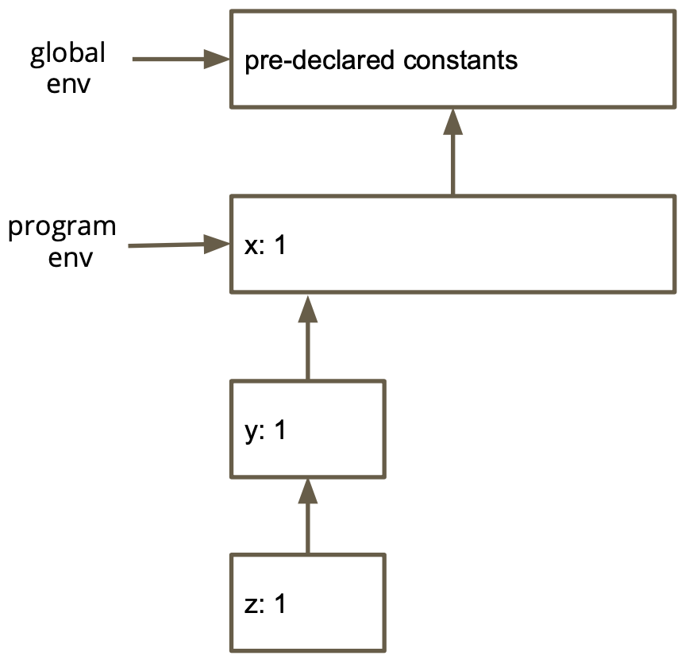

## Function Declarations
Functions are represented by "eyeballs". 

```
function add_one(x) {
    return x + 1;
}
```

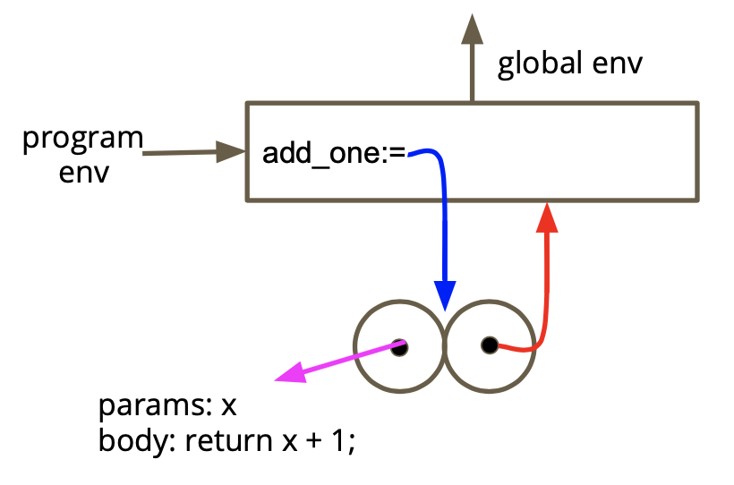

* One arrow (BLUE) points to the function. This arrow associates may not be present if the function does not have a name (lambda expressions).
* One arrow (MAGENTA) points from the left eyeball to the function parameters and body.
* One arrow (RED) points from the right eyeball to the environment where the function was evaluated to produce the function (where the function was "created").

## 4 Function Application Steps
0. Evaluate argument expressions
1. Follow arrow from right eyeball to identify environment where function is evaluated
2. If there are parameters, extend environment from step 1 and bind parameters to arguments
3. If there are any name declarations in the body of the function (look for `let`, `const` and `function` keywords), extend the current environment and bind names to values.
4. Evaluate and update frames

Let's try an example! This program doesn't do anything meaningful but should hopefully cover most of the important cases.

```
const z = 1;

function apply_func(f, x) {
    const y = x + z;
    return f(y);
}

if (true) {
    let y = apply_func(x => x, 1);
} else {
    let w = 1;
}
```

We start from top to bottom, evaluating any names that we find. We will evaluate the const `z` and the function `apply_func`.

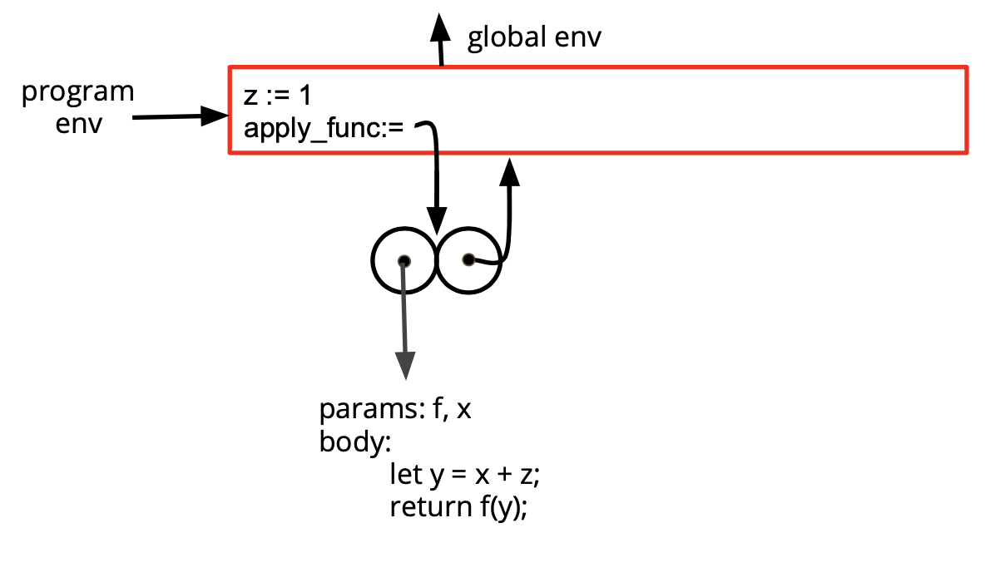

Now we have to deal with the if-else block. Since the conditional expression is true, we do not need to evaluate the else block.
Remember everytime there is a pair of curly braces we should create a new frame! At this point, before we apply the function the value of y is unassigned. We represent unassigned values with a blank space.

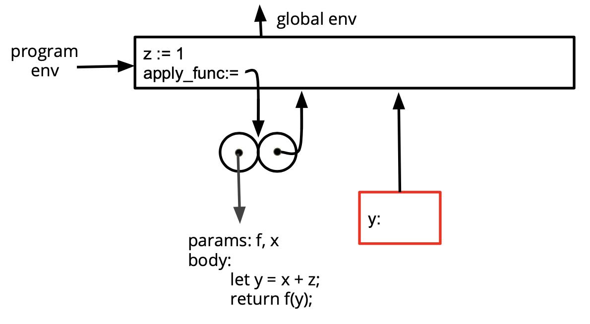

Now we can start to apply the function! Let's follow the steps.

### Step 0: Evaluate argument expressions
First step is to evaluate the argument expressions! The second argument is easy, 1 is already a primitive value. The first argument is a function, so we have to evaluate it in the current environment by creating a pair of "eyeballs". In this case, there is no arrow pointing to the lambda expression since lambda expressions have no names.

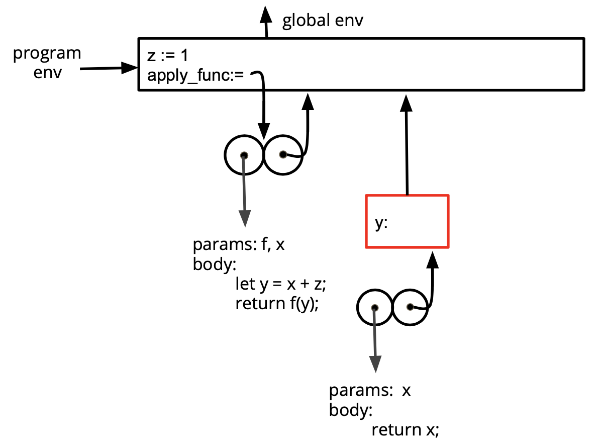

:::note
We use `return x` instead of `x` in the body of the left eyeball. Lambda expressions have an implicit return that we need to include. What is the difference between `x` and `return x`?
:::

### Step 1: Follow arrow from right eyeball to identify environment where function is evaluated
The environment which the right eyeball of `apply_func` points to is the program environment.

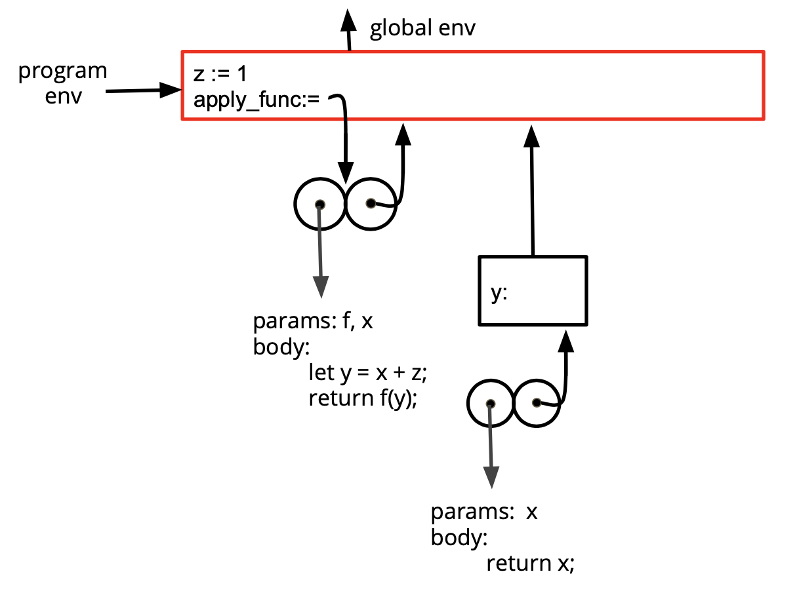

:::important
In this case the frame the function is called in and the frame where the function is evaluated at is different! The enviroment model does not keep track of this for us. We have to keep track of where the function was called ourselves.
:::

### Step 2: If there are parameters, extend environment from step 1 and bind parameters to arguments
Since we have 2 parameters, we extend the current environment and bind parameters to arguments.

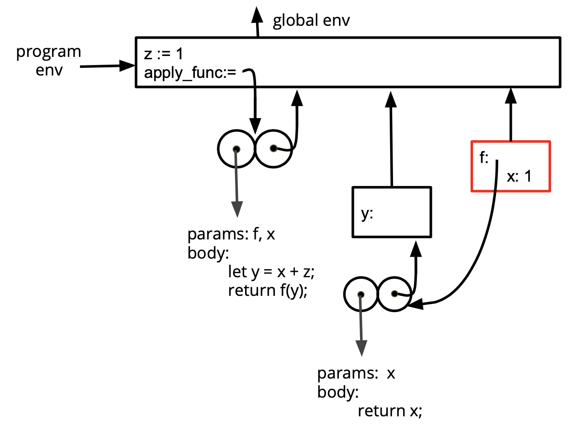

### Step 3: If there are any name declarations in the body of the function (look for `let`, `const` and `function` keywords), extend the current environment and bind names to values.
There is a name declaration in the body of our function, so we bind the name to the value unassigned (blank space).

From the current frame (red box), we look for the value of x. Since x is not defined in the current frame, we follow the arrow upwards until we find a frame with x. We repeat this process for z (follow arrow until program env). Once we have the values of x and y, we can evaluate it to get 2.

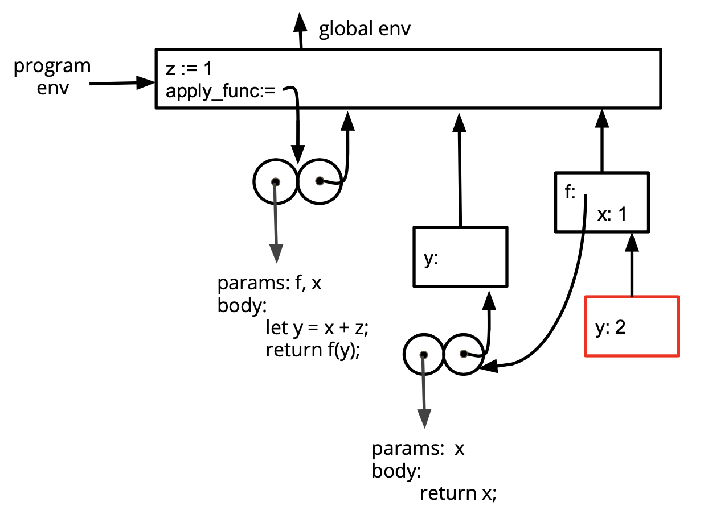

### Step 4: Evaluate and update frames
We evaluate the function! We only have the return statement left. 

Since the return expression is a function application, we have to repeat the steps above when applying `f` to `y`.

0. Evaluate the argument expressions. Since y is a primitive we do not have to evaluate any further.
1. Follow right eyeball to find environment.
2. Since there is a parameter x, extend frame and bind parameter x to 2 (value of y).
3. Since there are no name declarations in the body, no need for another frame.
4. Evaluate and return 2 (value of x)

Now that we have evaluated `f(y)` to be the number 2, we can return 2 and update the caller frame. We can now assign y to 2.

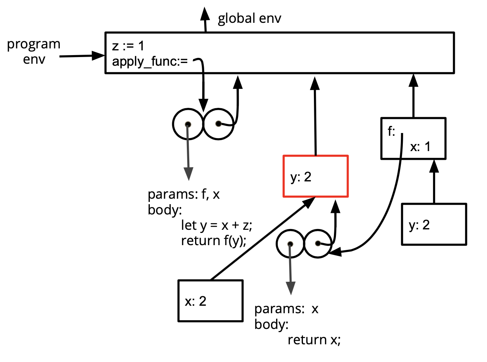