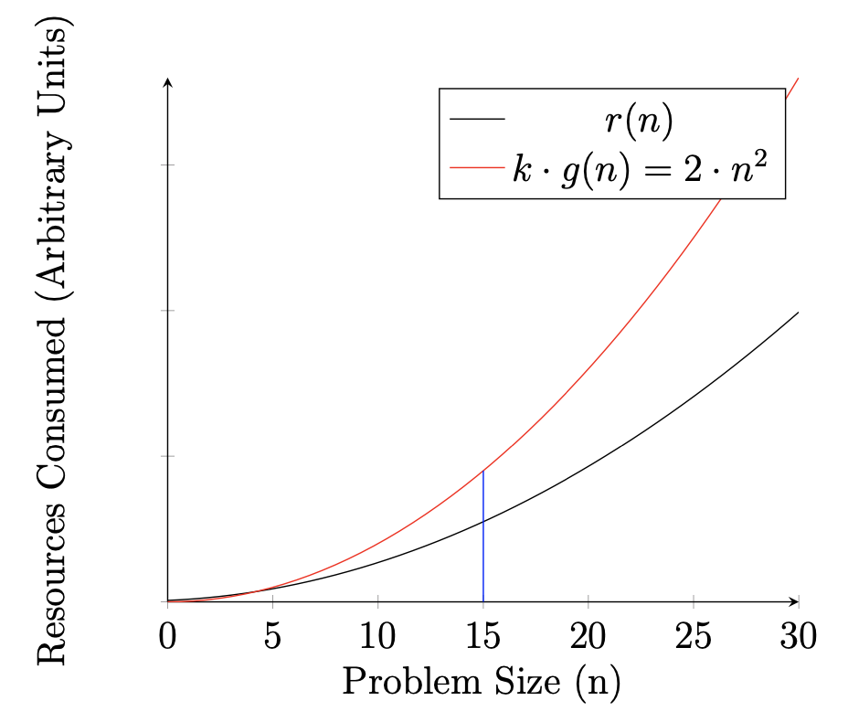

## Motivation
As computer scientists, we are often interested in how efficiently a program runs in terms of time and space. We could measure how long a program takes to run, but these would change depending on many factors such as what hardware you are using, the programming language used, and what inputs your program runs on. We need a more general way to classify and compare algorithms that is independent of these factors.

## Orders of Growth
Orders of Growth is a way to describe how much resources (time or space) are required *as the inputs become larger*. 

We call the amount of resources used required to run a program complexity. More specifically, we are interested in **time complexity** and **space complexity**, the amount of time and space a program requires as the inputs become larger.

We measure *time complexity* in terms of the number of (elementary) operations a program requires for an input of size n and *space complexity* in terms of the amount of memory required, in terms of the number of deferred operations or the number of elements in a data structure (see Studio S5).

:::note
Why do we count deferred operations as space? When we have deferred operations, we need to "remember" the deferred operations and this takes up memory too!
:::

We will cover three types of notations used to classify algorithms:
* Big O (O)
* Big Omega (Ω)
* Big Theta (θ)

## Big O Notation
Big O describes the upper bound of the amount of resources used by a program. A simplified definition is as follows:

* We say that function `r(n)` has order of growth `O(g(n))` if there is a positive constant k such that `r(n) ≤ k · g(n)` for any sufficiently large value of `n`.

Lets take a look at an example!

Suppose we have a function r(n) that requires some resources and follows the function `n² + 3 * n + 5`, the black line plotted in the diagram above. 

We can say that the function has order of growth O(n²) as long as we can find a positive constant k such that `k * n²` (the red line) is always greater than r(n) above some large value of n. In this example, if we set the large value of n to be 15 and the value of k to be 2, the red line (2 * n²) will always be above the black line (r(n)). So we can say that the function has order of growth O(n²).

:::important
Why do we disregard the constant factor when determining order of growth? Why not O(2n²) instead since k === 2?

 When it comes to orders of growth we are concern about how the resources consumed by a function grows as n becomes very large (formally as n approaches infinity). The constant factor doesn't change how the function behaves. If the resources used by a function grows exponentially as n increases, if we multiply the function by a constant factor it will still grow exponentially. We usually disregard the constant factor when analysing orders of growth.
:::

Notice that there are other functions that would also fit the definition above. For example, in this case, the functions `n³`, `2ⁿ`,`n² + 3 * n + 5`, can all be multiplied by a constant value k such that for a large enough n the equality always holds! Indeed, if we were to say that this function has order of growth `O(n³)`, `O(2ⁿ)` or `O(n² + 3 * n + 5)`, we would be correct! 

However, we are usually only interested in a tight bound for such functions as the other bounds usually do not give us any meaningful information.

### Big Omega notation
Big omega notation is similar to Big O notation except we are concered with the lower bound of a function instead! We simply need to flip over the equality in the definition. Instead of `r(n) ≤ k · g(n)` we now have `r(n) ≥ k · g(n)`. We use the symbol Ω instead of O when referring to Big Omega.

### Big Theta notation
Big theta is similar to the other two notations except that now we are concerned with the upper and lower (tight) bounds! If a function has order of growth O(g(n)) and Ω(g(n)), then it has order of growth θ(g(n)). In the definition, we modify it to check for upper and lower bound so the equality `k · g(n) ≤ r(n) ≤ j · g(n)`, where k and j are two constants.

## Determining Order of Growth from Formula
When we know the exact (or approximate) formula of a function, for example `n² * log n + n² + 3 * n + 5`, we can apply the following rules to obtain the order of growth.

1. Drop coefficients! In this case, we can simplify `3 * n` to `n` and `5 * 1` to `1`. We are left with `n² * log n + n² + n + 1`.
2. Multiply terms together! We can multiply `n²` and `log n` together to get `n² log n`.  We are left with `n² log n + n² + n + 1`.
3. Drop lower ordered terms. When n gets very large, the lower ordered terms become insignificant. For example, when n is close to infinity, n² will be much larger than n. In this case, the most significant term is `n² log n`. We can safely disregard the other terms.

The order of growth for this function is `O(n² log n)`.

## Common Orders of Growth
Ordered from fastest to slowest
* O(1) Constant
* O(log n) logarithmic
* O(n) linear
* O(n log n) loglinear (in some textbooks)
* O(n²) quadratic
* O(2ⁿ) exponential
* O(n!) factorial