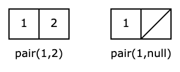
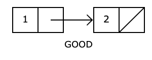
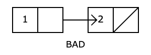

### Pairs
Pairs are simple data structures consisting of two data elements, a head and a tail.
An empty pair is defined as `null`.
Pairs can be constructed using the keyword `pair`, e.g. `pair(1, 2)`.

Pairs can be represented with box-and-pointer diagrams as follows:



### Head and Tail
Pairs have a head and a tail. To access retrieve the values at the head and tail, we use the keywords `head` and `tail` respectively.
```
const my_pair = pair(1,2);
head(my_pair); // Evaluates to 1
tail(my_pair); // Evaluates to 2
```

### Lists
A list is either:
1. null
2. A pair whose tail is a list

### Dos and Don'ts
Do:
* Start arrow anywhere inside the box
* Point *anywhere* on a pair


:::note
The arrow should point to the whole pair, not the head or the tail. The arrow should originate from either the head or the tail ("inside a box").
:::

Don't:
* Start arrow from outside a box
* Point arrow inside a box



### Box and List Notation
Lists (and pairs) can also be expressed in box and list notation.

For example, `list (1, pair(2, 3), 4)` can be expressed in box and list notaion as:

Box Notation: `[1, [[2, 3], [4, null]]]`

List Notation: `list(1, [2, 3], 4)`

For Box notation, we express each pair as square brackets, with a comma seperating the head and tail.
For List notation, we simplify any list using the `list` keyword **as far as possible**, and express pairs which cannot be simplified further in box notation.

:::tip
Every list should end with a null. For every list we create, there should be a corresponding null value.
:::

### Data Abstraction
Recall abstraction, the 'hiding' of smaller details so that we can focus on the larger details. Data abstraction is the idea of 'hiding' how a data structure is implemented so that we can focus on how the data structure is used. 

For example, the Point data structure is actually implemented as a pair! However, we should not **break abstraction** by using `head` and `tail`, but should instead use `x_of` and `y_of`. This allows us to use the data structure without having to worry about how it is implemented. If the programmer decides to change how the data structure is implemented (maybe an array instead of a pair!), he can do so and be sure that other programs will not break as long as he updates the `x_of` and `y_of` functions accordingly.